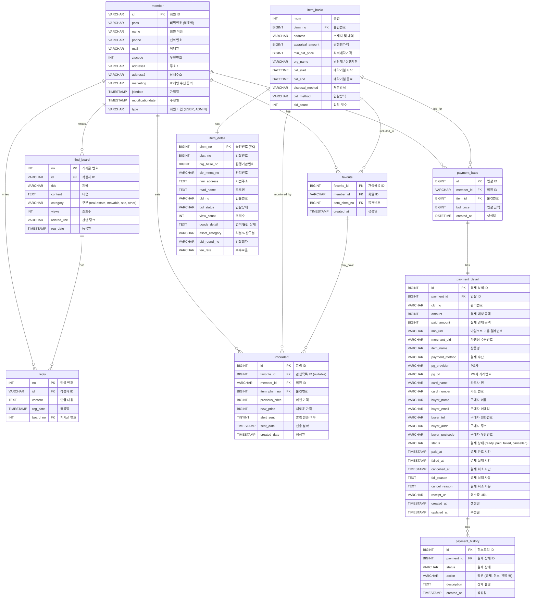

# 데이터베이스 ERD (Entity Relationship Diagram)

이 문서는 공공 부동산 경매 플랫폼의 데이터베이스 구조를 Mermaid 다이어그램으로 표현합니다.

## ERD 다이어그램



## 테이블 관계 설명

### 1. 회원 관련 관계
- **member ↔ favorite**: 한 회원은 여러 관심목록을 가질 수 있음 (1:N)
- **member ↔ payment_base**: 한 회원은 여러 입찰을 할 수 있음 (1:N)
- **member ↔ find_board**: 한 회원은 여러 게시글을 작성할 수 있음 (1:N)
- **member ↔ reply**: 한 회원은 여러 댓글을 작성할 수 있음 (1:N)
- **member ↔ PriceAlert**: 한 회원은 여러 가격 알림을 설정할 수 있음 (1:N)

### 2. 물건 관련 관계
- **item_basic ↔ item_detail**: 물건 기본 정보와 상세 정보는 1:1 관계
- **item_basic ↔ favorite**: 한 물건은 여러 회원의 관심목록에 포함될 수 있음 (1:N)
- **item_basic ↔ payment_base**: 한 물건은 여러 입찰 대상이 될 수 있음 (1:N)
- **item_basic ↔ PriceAlert**: 한 물건은 여러 가격 알림 대상이 될 수 있음 (1:N)

### 3. 결제 관련 관계
- **payment_base ↔ payment_detail**: 입찰 기본 정보와 결제 상세 정보는 1:1 관계
- **payment_detail ↔ payment_history**: 결제 상세 정보는 여러 이력을 가질 수 있음 (1:N)

### 4. 게시판 관련 관계
- **find_board ↔ reply**: 한 게시글은 여러 댓글을 가질 수 있음 (1:N)

### 5. 관심목록 관련 관계
- **favorite ↔ PriceAlert**: 관심목록은 가격 알림을 가질 수 있음 (1:N, nullable)

## 주요 인덱스

### member 테이블
- PRIMARY KEY: `id`

### item_basic 테이블
- PRIMARY KEY: `plnm_no`

### item_detail 테이블
- PRIMARY KEY: `plnm_no` (item_basic.plnm_no와 동일)

### favorite 테이블
- PRIMARY KEY: `favorite_id`
- UNIQUE KEY: `(member_id, item_plnm_no)` - 중복 방지
- INDEX: `idx_member_id`, `idx_item_plnm_no`

### PriceAlert 테이블
- PRIMARY KEY: `id`
- INDEX: `idx_favorite_id`, `idx_member_id`, `idx_item_plnm_no`, `idx_created_date`

### payment_base 테이블
- PRIMARY KEY: `id`
- INDEX: `idx_member_id`, `idx_item_id`

### payment_detail 테이블
- PRIMARY KEY: `id`
- UNIQUE KEY: `imp_uid`, `merchant_uid`
- INDEX: `idx_status`, `idx_payment_id`, `idx_cltr_no`, `idx_created_at`

### payment_history 테이블
- PRIMARY KEY: `id`
- INDEX: `idx_payment_id`, `idx_created_at`

### find_board 테이블
- PRIMARY KEY: `no`
- INDEX: `idx_id`, `idx_category`, `idx_reg_date`

### reply 테이블
- PRIMARY KEY: `no`
- INDEX: `idx_board_no`, `idx_id`, `idx_reg_date`

## 외래 키 제약조건

### CASCADE 정책
- **ON DELETE CASCADE**: 부모 레코드 삭제 시 자식 레코드도 함께 삭제
  - member 삭제 → favorite, payment_base, find_board, reply, PriceAlert 자동 삭제
  - item_basic 삭제 → favorite, payment_base, PriceAlert 자동 삭제
  - payment_base 삭제 → payment_detail 자동 삭제
  - payment_detail 삭제 → payment_history 자동 삭제
  - find_board 삭제 → reply 자동 삭제

- **ON DELETE SET NULL**: 부모 레코드 삭제 시 자식 레코드의 외래 키를 NULL로 설정
  - favorite 삭제 → PriceAlert.favorite_id가 NULL로 설정 (히스토리 보존)

## 데이터 흐름 예시

### 입찰 및 결제 흐름
```
1. member (회원) 
   ↓
2. payment_base (입찰 기본 정보 생성)
   ↓
3. payment_detail (결제 상세 정보 생성, status: "ready")
   ↓
4. payment_history (결제 이력 기록)
   ↓
5. payment_detail (status: "paid"로 업데이트)
```

### 관심목록 및 알림 흐름
```
1. member (회원)
   ↓
2. favorite (관심목록 추가)
   ↓
3. PriceAlert (가격 알림 설정, optional)
   ↓
4. 가격 변동 감지 시 알림 발송
```

## 참고사항

- 모든 테이블은 `utf8mb4` 문자셋과 `utf8mb4_unicode_ci` 콜레이션을 사용합니다.
- 모든 테이블은 `InnoDB` 엔진을 사용합니다.
- 타임스탬프 필드는 자동으로 생성/업데이트됩니다 (`DEFAULT CURRENT_TIMESTAMP`, `ON UPDATE CURRENT_TIMESTAMP`).
- 결제 상태는 `ready`, `paid`, `failed`, `cancelled` 값을 가질 수 있습니다.

